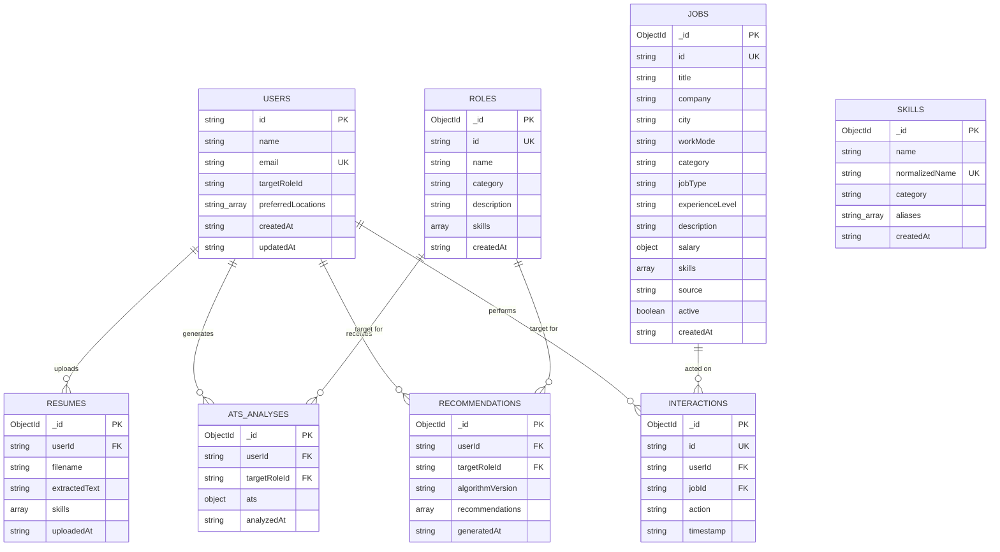

# MongoDB Data Model Specification

This document details the document schemas, collections, relationships, and index definitions for the **AI Career Advisor** platform.

---

## 1. Document Relationships Diagram



---

## 2. Detailed Collection Schemas

### 2.1 `users` Collection
Stores user profile information, target direction preferences, and activity context.

```json
{
  "_id": "ObjectId(...)",
  "id": "demo-user-alex-sharma",
  "name": "Alex Sharma",
  "email": "alex.sharma@example.com",
  "targetRoleId": "data-analyst",
  "preferredLocations": ["Remote", "Portland"],
  "createdAt": "2026-10-03T08:00:00.000Z",
  "updatedAt": "2026-10-03T08:00:00.000Z"
}
```
- **Indexes**:
  - `{ email: 1 }` (unique, sparse)
  - `{ id: 1 }` (unique, sparse)

---

### 2.2 `skills` Collection
Canonical skill taxonomy used for deterministic multi-word and alias phrase extraction.

```json
{
  "_id": "ObjectId(...)",
  "name": "SQL",
  "normalizedName": "sql",
  "category": "Data & Analysis",
  "aliases": ["structured query language", "mysql", "postgresql", "t-sql"],
  "createdAt": "2026-10-03T08:00:00.000Z"
}
```
- **Indexes**:
  - `{ normalizedName: 1 }` (unique)
  - `{ name: 1 }`

---

### 2.3 `roles` Collection
Catalog of supported career targets with weighted requirements (`core`, `important`, `additional`).

```json
{
  "_id": "ObjectId(...)",
  "id": "data-analyst",
  "name": "Data Analyst",
  "category": "Data",
  "description": "Transforms raw operational data into actionable dashboards and business insights.",
  "skills": [
    { "name": "SQL", "weight": 25, "priority": "core" },
    { "name": "Excel", "weight": 20, "priority": "core" },
    { "name": "Tableau", "weight": 15, "priority": "important" },
    { "name": "Python", "weight": 15, "priority": "important" },
    { "name": "Data Visualization", "weight": 15, "priority": "important" },
    { "name": "Statistics", "weight": 10, "priority": "additional" }
  ],
  "createdAt": "2026-10-03T08:00:00.000Z",
  "updatedAt": "2026-10-03T08:00:00.000Z"
}
```
- **Indexes**:
  - `{ id: 1 }` (unique)
  - `{ name: 1 }`

---

### 2.4 `jobs` Collection
Synthetic curated opportunities used for learning, skill comparison, and recommendation scoring.

```json
{
  "_id": "ObjectId(...)",
  "id": "job-001",
  "title": "Junior Business Intelligence Analyst",
  "company": "Northwest Data Co",
  "city": "Portland, OR",
  "workMode": "Hybrid",
  "category": "Data",
  "jobType": "Full-Time",
  "experienceLevel": "Junior",
  "description": "Build automated reporting pipelines and executive dashboards in SQL and Tableau.",
  "salary": {
    "min": 68000,
    "max": 82000,
    "currency": "USD"
  },
  "skills": [
    { "name": "SQL", "weight": 30, "priority": "core" },
    { "name": "Tableau", "weight": 25, "priority": "core" },
    { "name": "Excel", "weight": 20, "priority": "important" },
    { "name": "Python", "weight": 15, "priority": "important" },
    { "name": "Communication", "weight": 10, "priority": "additional" }
  ],
  "source": "Demo Dataset",
  "active": true,
  "createdAt": "2026-09-15T00:00:00.000Z"
}
```
- **Indexes**:
  - `{ id: 1 }` (unique)
  - `{ category: 1 }`
  - `{ "location.city": 1 }`
  - `{ jobType: 1 }`
  - `{ workMode: 1 }`
  - `{ active: 1 }`

---

### 2.5 `resumes` Collection
Stores user uploaded resume metadata, extracted text, and detected skill signals.

```json
{
  "_id": "ObjectId(...)",
  "userId": "demo-user-alex-sharma",
  "filename": "maya-chen-resume.pdf",
  "extractedText": "Maya Chen\nEducation: B.S. Information Systems...",
  "skills": [
    {
      "name": "SQL",
      "category": "Data & Analysis",
      "confidence": 0.92,
      "source": "Mentioned in resume text"
    }
  ],
  "uploadedAt": "2026-10-03T08:15:00.000Z",
  "updatedAt": "2026-10-03T08:15:00.000Z"
}
```
- **Indexes**:
  - `{ userId: 1, uploadedAt: -1 }`

---

### 2.6 `ats_analyses` Collection
Stores explainable heuristic ATS scoring evaluations, breakdown dimensions, and actionable suggestions.

```json
{
  "_id": "ObjectId(...)",
  "userId": "demo-user-alex-sharma",
  "resumeId": "ObjectId(...)",
  "targetRoleId": "data-analyst",
  "ats": {
    "overallScore": 84,
    "breakdown": {
      "keywords": 85,
      "skills": 83,
      "sections": 86,
      "projects": 100,
      "contact": 100,
      "formatting": 100
    },
    "matchedKeywords": ["SQL", "Python", "Tableau", "Excel"],
    "missingKeywords": ["Statistics"],
    "sections": ["Education", "Projects", "Experience", "Skills"],
    "recommendations": [
      "Include relevant role terms such as Statistics in context."
    ]
  },
  "analyzedAt": "2026-10-03T08:15:00.000Z"
}
```
- **Indexes**:
  - `{ userId: 1, targetRoleId: 1, analyzedAt: -1 }`

---

### 2.7 `recommendations` Collection
Stores ranked recommendation outcomes, match percentages, component sub-scores, and explanations.

```json
{
  "_id": "ObjectId(...)",
  "userId": "demo-user-alex-sharma",
  "resumeId": "ObjectId(...)",
  "targetRoleId": "data-analyst",
  "algorithmVersion": "v1",
  "recommendations": [
    {
      "id": "job-001",
      "title": "Junior Business Intelligence Analyst",
      "company": "Northwest Data Co",
      "matchScore": 89,
      "skillMatch": 90,
      "textSimilarity": 87,
      "matchedSkills": ["SQL", "Tableau", "Excel", "Python"],
      "missingSkills": ["Communication"],
      "explanation": [
        "This synthetic listing fits the Data Analyst path you selected.",
        "Resume lists SQL, which this role requests.",
        "Still to build: Communication."
      ]
    }
  ],
  "generatedAt": "2026-10-03T08:15:00.000Z"
}
```
- **Indexes**:
  - `{ userId: 1, targetRoleId: 1, generatedAt: -1 }`

---

### 2.8 `interactions` Collection
Stores persistent user actions (`viewed`, `saved`, `applied`) without reliance on browser localStorage.

```json
{
  "_id": "ObjectId(...)",
  "id": "demo-user-alex-sharma-job-001-saved-1790999000",
  "userId": "demo-user-alex-sharma",
  "jobId": "job-001",
  "action": "saved",
  "timestamp": "2026-10-03T08:20:00.000Z"
}
```
- **Indexes**:
  - `{ userId: 1, jobId: 1, action: 1 }`
  - `{ userId: 1, timestamp: -1 }`
